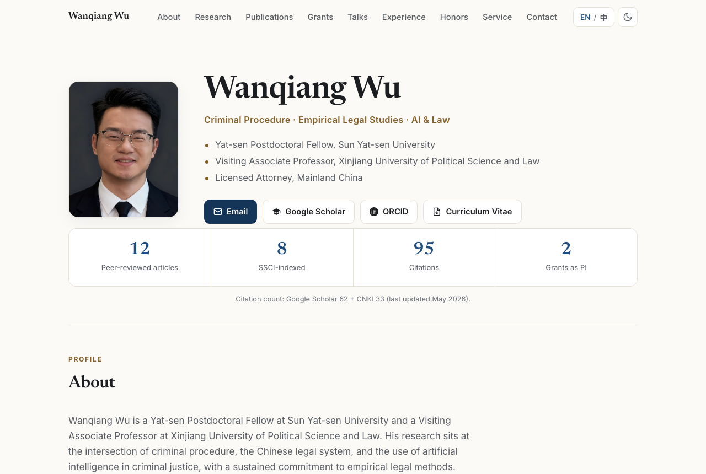

# Wanqiang Wu (吴万强) — Personal Academic Website

[](https://aidenwu2.github.io/)
&nbsp;[](#)
&nbsp;[](#)
&nbsp;[](LICENSE)

A self-contained, **bilingual (English / 中文)** academic homepage. No framework,
no build step, no dependencies — just three static files you can host anywhere.

### ▶ Live at **https://aidenwu2.github.io/**



## Features

- **Bilingual EN / 中** toggle — auto-detects the visitor's browser language and remembers the choice.
- **Light / dark mode** — follows the system setting, toggleable, persisted.
- **Responsive & accessible** — WCAG AA contrast, keyboard-operable controls, `prefers-reduced-motion` aware.
- **Publications** with a year filter, journal-tier badges, authorship roles, and DOI links.
- Sections: About, Research, Publications, Grants, Talks, Teaching, Experience, Honors, Service, Contact.
- Downloadable CV in English and 中文.

## Project structure

```
.
├── index.html            # page skeleton + hero (works without JavaScript)
├── assets/
│   ├── styles.css        # all styling (light/dark, responsive, print)
│   ├── data.js           # ← edit this to update content (single source for dynamic sections)
│   ├── app.js            # rendering + interactions
│   ├── photo.jpg         # portrait
│   ├── preview.png       # README preview image
│   ├── CV_Wanqiang_Wu.pdf
│   └── CV_Wu_Wanqiang_zh.pdf
└── README.md
```

## Edit the content

Every dynamic section (About, Publications, Grants … Contact) is rendered from
**`assets/data.js`** — that is the file to edit for almost everything. To add a
publication, copy a block in the `publications` array and change the fields:

```js
{ year: 2026, date: { en: "Jun 2026", zh: "2026 年 6 月" },
  authors: "<b>Wu, W.</b>, &amp; Coauthor, A.",
  title: "Your paper title",
  venue: "Journal Name", detail: "12(3): 1–20",
  badges: ["SSCI · Q1", "Top 10%"],
  role: { en: "First author", zh: "第一作者" },
  lead: true,                       // optional: highlights the entry
  url: "https://doi.org/..." },
```

The one exception is the hero name / tagline / roles, which are static bilingual
HTML in `index.html` (so the page still shows your identity with JavaScript
disabled); edit those three lines there.

## Local preview

```bash
cd personal-website
python3 -m http.server 8000   # then open http://localhost:8000
```

## Deploy / update

This site is published with **GitHub Pages** from branch `main`, root folder.
To update it: edit, commit, push — it redeploys in about a minute.

```bash
git commit -am "update publications"
git push
```

For a custom domain, add a `CNAME` file with the domain and point a DNS record at
the host.

## Notes

- Language defaults to the visitor's browser language; light/dark follows the system. Both choices persist in `localStorage`.
- The hero is in static HTML, so it shows even with JavaScript disabled; the publication list and other sections are rendered from `data.js`.
- Web fonts load from Google Fonts. To go fully offline, remove the font `<link>` tags in `index.html` — the CSS falls back to system serif/sans stacks (including CJK).

## License

Code released under the MIT License. Personal content (CV, photograph, publication
list) © Wanqiang Wu.
